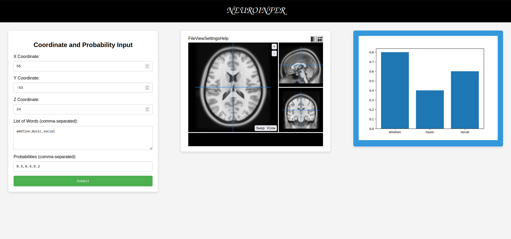

# *NeuroInfer*

A Bayesian Analysis tool ...
when it should be used ...
the goal is to provide researchers with ...

## GUI: A web-visualizer

## To DO:

**Analysis:**
  - [ ] general optimization of the analysis code
  - [ ] implementation searchlight analysis
  - [ ] implementation whole-brain analysis
  - [ ] implementation of atlas-guided analysis

**Results:**
   - _**back-end:**_
       - [ ] MainScript.py should be turned into __init__.py
       - [ ] UserInputs.py should be turned into a listener of the script form
       - [ ] index.html should be automatically open when the python script is run
       - [ ] create a python script to listen to the scripts output and lunch the anlaysis.

   - _**front-end:**_
        - [ ] add a loading image in the web page while the analysis is run (and possibly estimate the time)
        - [ ] add an info box in the web page if the python script is detached
        - [ ] fix mni template showing when loading the page
        - [ ] implementing labeling overimposed to brain template (HTML5 & canvas)
        - [ ] implementing multi plots/results viewing/selection

## Folder structure

    ./neuroinfer/
    ├── code/
    │   │── plot_generator.py       # a template using flask_cors to interact with the javascript
    │   │── DataLoading.py
    │   │── BayesianAnalysis.py     # core bayesian anlaysis work
    │   │── SummaryReport.py
    │   │── UserInputs.py           # expects input from the command-line
    │   └── MainScript.py           # main script (to be moved inside __init__.py)
    ├── html/
    │   │── index.html              # this should be automatically open when the python 
    │   │── main.js                 # provide the scripts to itneract with python
    │   │── styles.css
    │   └── viewer-config.js        # initialize neuroimaging div with mni template
    ├── templates/
    │   └── {...}.nii.gz
    ├── data/                       # it contains the bibliography data needed to compute the analysis
    │   │── featuures7.npz
    │   │── metadata7.csv
    │   │── vocabulary7.txt
    │   │── data-neurosynth_version-7_metadata.tsv
    │   └── data-neurosynth_version-7_coordinates.tsv
    ├── rii-mango-Papaya-#####/     # from papaya repo. it hosts the papaya visualizer js
    ├── images/     
    └── README.md
